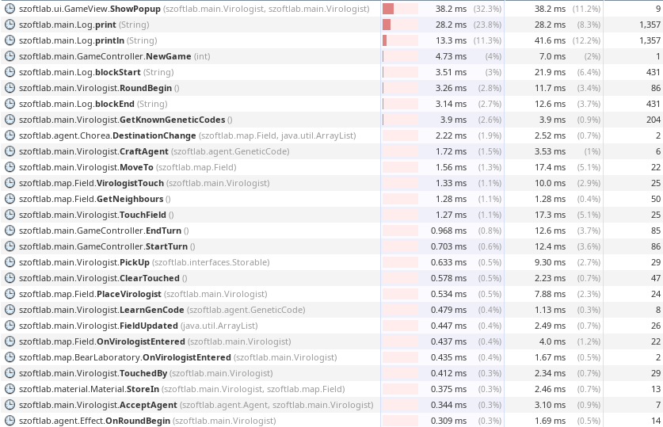
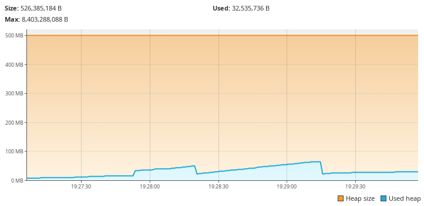
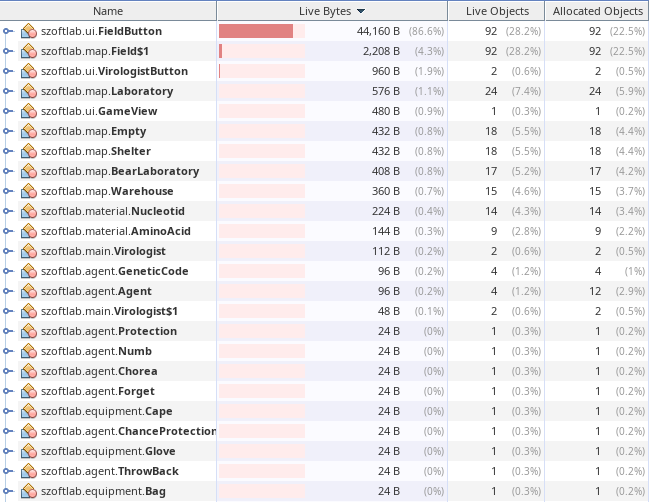

# Teljesítmény mérés

JVM alapú programok memória és CPU idő használatát lehet mérni profiling programok segítségével, például a [VisualVM](https://visualvm.github.io/). 

Az alábbi mérések egy ~5 perces futás eredménye.

## CPU idő

Mint látható a méréseken a cpu idő esemény vezérelt programoknál elhanyagolható mértékű, mivel a program legtöbb ideje várakozással telik.

Ettől függetlenül a legtöbb időt a konzolra írás teszi ki, 
mivel a konzolra írás egy lassú művelet, ezért érdemes a konzolra írást kikapcsolni ha nem szükséges. Ezzel ~20%-al kevesebb időt vesz igénybe a program futása.

## Memória használat

Mint láthatjuk a program memória használata maximum 67MB-ot ért el, ami a mai gépeken elhanyagolható mértékű.

A memória használat részleteit vizsgálva láthatjuk, hogy a program futása során a legtöbb memória a UI számára van lefoglalva, pontosabban a FieldButton osztály számára, mivel a játék elemeit ez az osztály tárolja.

Ami kitűnik még a statisztikából, hogy a Nucleotid és AminoAcid osztályok többször vannak példányosítva, mint a többi osztály, mivel a játék során csak 2-2 elemet hoztunk létre belőlük, de a program 10 példányt is létrehozott belőlük.
