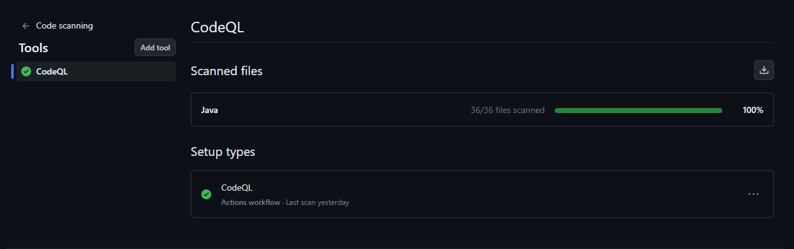
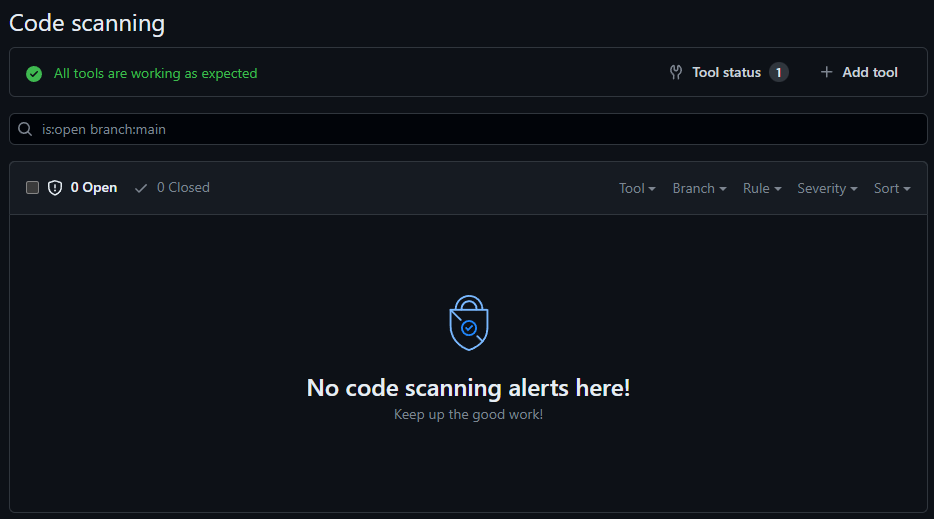

# Security

## Általános biztonság

A program alapvetően kifejezetten biztonságosnak tekinthető, hiszen nem valósít meg semmiféle hálózati kommunikációt, kizárólag offline funkcionalitással rendelkezik, ezen felül nem tárol semmiféle felhasználói adatot, így a felhasználók semmiféle érzékeny adatait nem képes tárolni az alkalmazás. A program futtatásához szükséges fájlok a felhasználó számítógépén tárolódnak, így azokhoz csak a felhasználó férhet hozzá. A program szempontjábó ezért nem beszélhetünk hagyományos értelemben vett biztonsági kockázatról, hiszen ebben az nincs kitéve semmilyen külső támadó általi behatásnak. Ennek ellenére tágabb értelemben van értelme egy ilyen offline játék esetében is megvizsgálni ezt a szempontot.

## Csalás

Tekintsük például security szempontként a játékbeli csalások témáját. Itt elsősorban kitérnék olyan sérülékenységekre, amelyek alapvetően nem állnak szemben a játék elvárt működésével, a játék tervezése során lefektetett funkcionális követelményeket teljesen kielégítik, de mégis a tervezési döntések következtében esélyt adnak csalásra, akár még ilyen szándék nélküli játékosok esetén is. A játék alapvető eleme, hogy a virológusok vakon vándorolnak a pálya mezőin, így a játékosok a saját körükben kizárólag a saját virológusukat, annak környezetében lévő mezőit (értve itt azok a felhasználói felületen látható tulajdonságait), illetve az azonos mezőn álló virológusokat látják csak. Ennek a feltételezésnek a következtében csalásnak tekinthető bármilyen olyan információ megszerzése, amit a virológust irányító játékosok a saját körükben nem láthatnak. Ennek tökéletes példája az, hogy mivel a játékos köre azonnal véget ér, ha már nem képes cselekedni, viszont ezzel egyidejűleg elkezdődik a következő játékos köre. Mindez azt eredményezi, hogy a játékos a körének végére érve mindenféle csalási szándék nélkül látja azt, amit a következő játékos lát. Ezt a problémát könnyen lehetne orvosolni egy kör vége után megjelenő köztes képernyővel, ami csak valamilyen felhasználói input hatására tűnik el ezzel elindítva a következő kört. A játékosok ennek a képernyőnek a megjelenésekor cserélnének. Ezzel a megoldással a játékosoknak nem lenne lehetősége a következő játékos körének megfigyelésére, így a fent említett csalási lehetőség is megszűnne. A játék természetéből adódóan felmerül annak is a problémája, hogy a játékosok azonos helyen tartózkodnak, így lehetőségük lehet lesni más játékos körében vagy egymással kommunikálva plusz információhoz jutni. Ez bár valós veszély, de az eliminálása meglehetősen komplikált és jó közelítéssel feleslegesnek is tekinthető, nem is beszélve arról, hogy a játékszabály explicit módon nem tiltja sem a kommunikációt, sem a más jellegű összedolgozást (ezt tekinthetjük szürke zónának).

## Java

A játék biztonságához az is nagy mértékben hozzájárul, hogy Java nyelven íródott. A Java Compiler más, nyelvekhez képest egész sok hibát képes elkapni. Mivel nem történik direkt memória elérés így valószínűtlen, hogy más alkalmazások és programok által használt memóriára hivatkozzunk. A beépített memória managementnek hála nem kell manuálisan felszabadítani a memóriát ezzel megint rengeteg sérülékenységet kizárva. A nyelv statikusan típusos így rengeteg típushibától meg tud kímélni minket. A hozzáférés módosítók plusz védelmet jelentenek a nem szándékos felülbírálás megakadályozásával. Futtatás előtt pedig egy bytecode-ellenőrzés végrehajtásra kerül, ami csökkenti a rosszindulatú kód futtatásának kockázatát. Ezeken felül még számos biztonsági funkcióval rendelkezik a Java, amiket nem sorolnék föl, de a fentiek alapján is látható, hogy a Java nyelv nagy hangsúlyt fektet a biztonságra, ez persze jelentős performancia veszteséggel és egyéb kompromisszumokkal jár.

## CodeQL

A biztonsági problémák felderítésére beállítottam a projektre a CodeQL-t, amely GitHub által a biztonsági ellenőrzések automatizálására kifejlesztett kódelemző motor.

A scanelés eredményeként a tesztelő eszköz nem talált semmilyen sérülékenységet:

