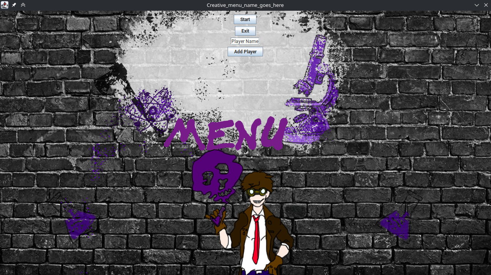
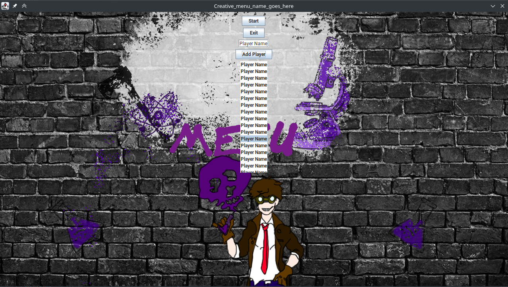
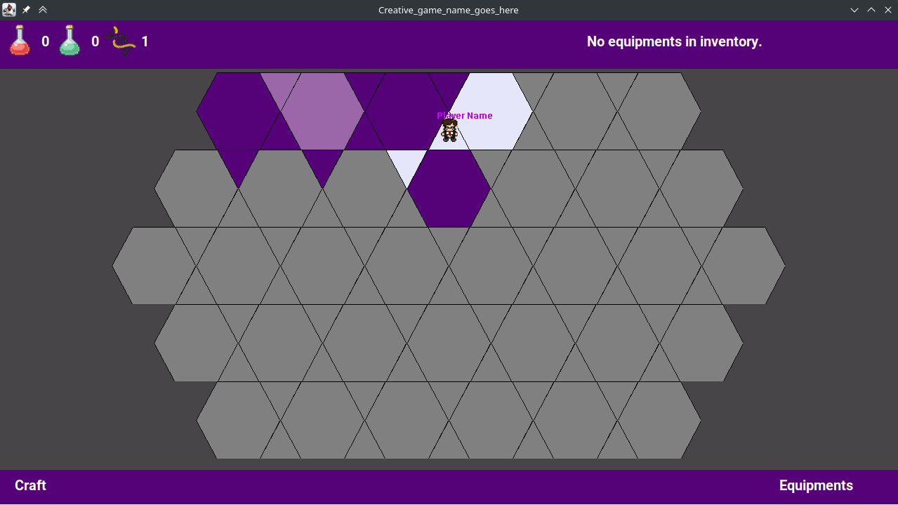
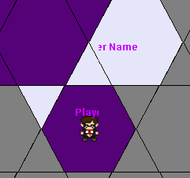
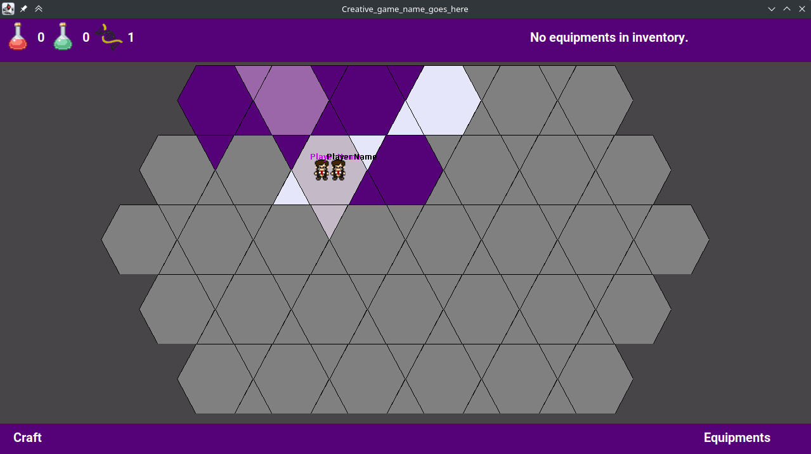

# Használhatóság

## Bevezetés
Egy alkalmazás megítélésében nagy szerepet játszik, hogy azt a felhasználóinak mennyire könnyű
az elképzelésüknek és elvárásaiknak megfelelően használni. Fontos továbbá, hogy a felhasználói felület
intuitív legyen, azaz a program használói akár külön előképzettség nélkül (egy játék esetében ez 
hatványozottan igaz) sikeresen eligazodjon például a menürendszerben és esetünkben a játékmenet során is.

## Menü
A játék elindításakor egy menüképernyő fogad minket. Ez a felület alapvetően ellátja a funkcióját,
megtalálhatóak rajta az elvárt elemek: játékosokat adhatunk hozzá a játékhoz, játékot indíthatunk,
valamint kiléphetünk belőle.

A menüképernyőn a gombok elhelyezése azonban lehetne jobb: a legtöbb alkalmazásban a kilépés gomb
a legutolsó opció, így ha valaki ehhez van szokva, akkor előfordulhat, hogy véletlenül rossz gombot
nyom a kilépés helyett. Hasonlóan, célszerűbb lenne a _Start_ gombot a játékosok hozzáadása rész
után helyezni, hiszen ha valaki játékot szeretne kezdeni, akkor ez a logikus sorrend: megadja a 
kívánt számú és nevű játékosokat, majd a _Start_ gombra kattintva megkezdi a játékot (ebben az esetben
nem szükséges a játékosok felvételét követően újra a képernyő tetején kattintani).
Hasznos lenne még egy játékszabályokat ismertető rész hozzáadása, hogy külön dokumentáció nélkül is
egyértelművé váljon a játék menete és irányítása.

A játékosok nevét váró beviteli mező is válhatna kényelmesebben használhatóvá. A _placeholder text_
nem tűnik el a mezőbe kattintva, így a felhasználóknak először ki kell törölni a "Player Name" feliratot,
és csak ezt követően adhatják meg a saját nevüket. Bár a Java Swing keretrendszer erre önmagában nem
kínál megoldást, egy saját `JTextField` leszármazottal (és ehhez egy egyedi `FocusListener` 
implementációval) könnyen megvalósítható a kívánt viselkedés.

A menüben található vezérlőelemek méretének növelésével és azokat a háttér fehérre színezett részének 
közepére igazításával is lehetne javítani a felhasználói élményt. A játékosok számát még a menüképernyőn
úgy kellene korlátozni, hogy a játékosok hozzáadása során a játékosok listája ne lógjon ki az erre szánt
helyről. Hasznos lenne továbbá ellenőrizni, hogy ne lehessen két azonos nevű játékos, így elkerülve az
esetleges félreértéseket a játék során.

Az alábbi képernyőképen láthatjuk, hogy mi történik, ha túl sok játékost veszünk fel (figyeljük meg, 
hogy az alkalmazás nem különbözteti meg őket, így a játék során nehéz megállapítani, hogy éppen melyik
játékos következik).

## Játékmenet
A játék indítását követően egy új, a menütől különböző ablak jelenik meg (nem a menü ablakának változik
meg a tartalma, hanem a menü ablaka bezárásra kerül, és egy teljesen új ablakban jelenik meg a játéktér).
Mivel az új ablak nem feltétlenül a régivel megegyező helyen jelenik meg, ez problémát okozhat például
ha az alkalmazást több képernyővel rendelkező számítógépen szeretnénk futtatni.

A játékmezőn való navigáció az egyes mezőkre kattintást követően megjelenő kontextusmenüben érhető el.
Itt választhatja ki a soron lévő játékos, hogy milyen műveletet végez az adott körben.
A játékost jelölő ikonra kattintva a program megjeleníti a játékos nevét, így - amennyiben egymástól
különböző neveket adtunk meg - jól követhető, hogy melyik játékos hol tartózkodik. Mindig csak az éppen
soron következő játékos figurája látszik, viszont a táblán "brute force" módon össze-vissza 
kattintgatva kis szerencsével rákattinthatunk az éppen rejtett bábura, ezzel felfedve hollétét
(az ikonja ugyan nem jelenik meg, de a kontextusmenü megjelenik, elárulva a játékos nevét is).
Problémát jelenthet továbbá, hogy amint a játékos kiválasztja, hogy melyik mezőre szeretne lépni,
a karaktere eltűnik, és a következő játékos figurája válik láthatóvá, így a lépő játékos 
nem kap egyértelmű visszajelzést a cselekvésének következményéről. Segíti viszont a 
játékosokat a tájékozódásban, hogy a különböző típusú mezők különböző megfelelő színnel 
vannak jelölve a játéktéren. A navigáció során nehézséget jelenthet, hogy az egyes mezők _hitboxai_
nem pontosan fedik a sokszögeket, így előfordulhat, hogy a látszólag kiválasztott mező helyett
egy másikkal interaktál a játékos.

Bár a _craftolás_ menüje kellően egyszerű és könnyen kezelhető, a szükséges nyersanyagok összegyűjtése
nehézkes. A játékélményt (és a győzelem esélyét) növelné, ha gyorsabban fel lehetne deríteni a
pályát, ezáltal megismerve, hogy melyik mezőn milyen nyersanyag található.

A játéktér ugyan színtévesztők számára is használható (nincsenek összetéveszthető, egybemosódó 
színek), de a játékosok neve nem minden esetben olvasható jól. Ennek oka lehet megjelenítési hiba
(lásd a következő képek) vagy az, hogy az adott színnel írt szöveg nem minden esetben olvasható 
könnyen. Utóbbihoz a szöveg méretezése is hozzájárul. A megjelenítési hibákat a rajzoló- és 
felhasználóifelület-frissítő függvények helyes sorrendben való hívásával lehetne javítani.

